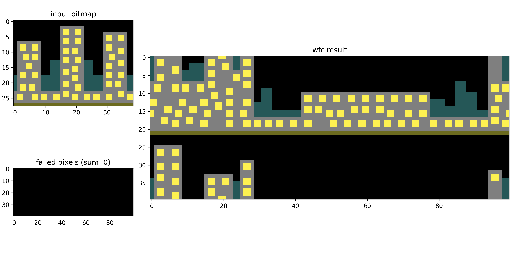

# WaveFunctionCollapse_MAF2
 
A WavaFunctionCollapse algoritmust implementáltuk, 
[ezen](https://discourse.processing.org/t/wave-collapse-function-algorithm-in-processing/12983)
fórum mentén.

## Példa használat

A `w`

