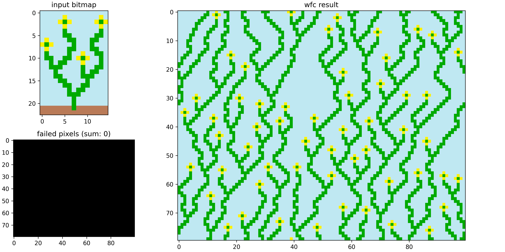

# WaveFunctionCollapse_MAF2
 
A WavaFunctionCollapse algoritmust implementáltuk, 
[ezen](https://discourse.processing.org/t/wave-collapse-function-algorithm-in-processing/12983)
fórum mentén.

A forráskód a [notebookban](MAF2wfc.ipynb) található.
Egy `WFC` nevű osztály tartalmazza az algoritmus rutinjait, a kövezkezőkben látszik egy példa a használatára.

## Példa futás

A `w = WFC(imPath, imDims, out_dims)` sorral lehet egy új elemét készíteni az osztálynak,
ami a `imPath` alapján kapott input képet feldolgozza,
majd a `w.run()` meghívásával fut le rá a WaveFunctionCollapse algoritmus.


Az `imDims` paramétert az input kép valós felbontására kell beállítani 
(pl lehet hogy a .png file nagyobb felbontású, mint a bitmap maga).


Az `out_dims` specifikálja, hogy mekkora képet generáljon az algoritmus.
Az alapértelmezet kimeneti felbontás 80 x 100.


Ha a `gif_len` paraméter is meg van adva a `run` függvényben, mint pl `w.run(gif_len = 100)`, 
akkor futás közben egy 100 képből 
álló gif is készül az algoritmus közbülső lépései szemléltetésére.

Alapvetően a `w.plot()` hívásával láthatjuk az input bitmap, a generált kép és az elletmondásos pixelek
grafikonját.

Másképpen az output képet a `w.output_image` attribútummal is lekérhetjük, amit pl a `plt.imshow()` parancsal lehet vizualizálni.
A gif animáció a `images/gif_out.gif` fileba mentődik.

---

Például a virágos képet a következő képpen futtathtjuk:

```python
w = WFC("images/flowers.png", imDims = (15,23))
w.run(gif_len = 100)
w.plot()
```



Az animáció:

